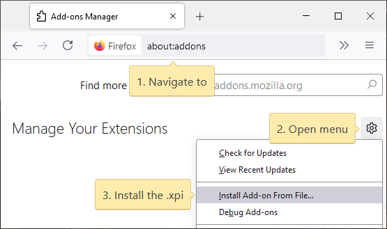

# QuickShards for Melvor Idle
A simple browser extension that enables quickly buying shards from the Summoning page.

## Installation
Links will be added for the Chrome Extension stores once approved. In the meantime, if you're a Chrome user you can manually load the extension by downloading the [latest release](https://github.com/ChaseStrackbein/melvor-idle-quickshards/releases/latest) and following the instructions for manually loading extensions below, or use the userscript.

### Chrome
Download the quickshards_for_melvor_idle-\[version\]-**chrome.zip** file from the latest release and extract the .zip contents to a folder of your choice.
1. Navigate to [chrome://extensions/](chrome://extensions/)
2. Enable developer mode if not already enabled
3. Select 'Load unpacked' and load the folder extracted from the .zip file.

### Firefox
[Get QuickShards for Firefox](https://addons.mozilla.org/en-US/firefox/addon/quickshards-for-melvor-idle/)

Or, to manually install the extension:
Download the quickshards_for_melvor_idle-\[version\]-**firefox.xpi** file from the latest release.
1. Navigate to [about:addons](about:addons)
2. Open the settings menu (cog icon)
3. Select 'Install Add-on From File...' and load the .xpi file.

### Userscript
[Get the userscript](https://greasyfork.org/en/scripts/428146-quickshards-for-melvor-idle) *(incompatible with Greasemonkey)*

## Usage
The quantity represents how many of the currently opened recipe you would like to buy. For example, a recipe that requires 6 red summoning shards will result in the following:
* x1 = 6 shards
* x10 = 60 shards

If you already owned an amount of the required shards, that will be deducted from the total shard purchase, for example if you had 4 red summoning shards in the bank with the previous example:
* x1 = 2 shards
* x10 = 56 shards

## Screenshots

### Automatically adjusts recipes to your bank contents (toggleable)
